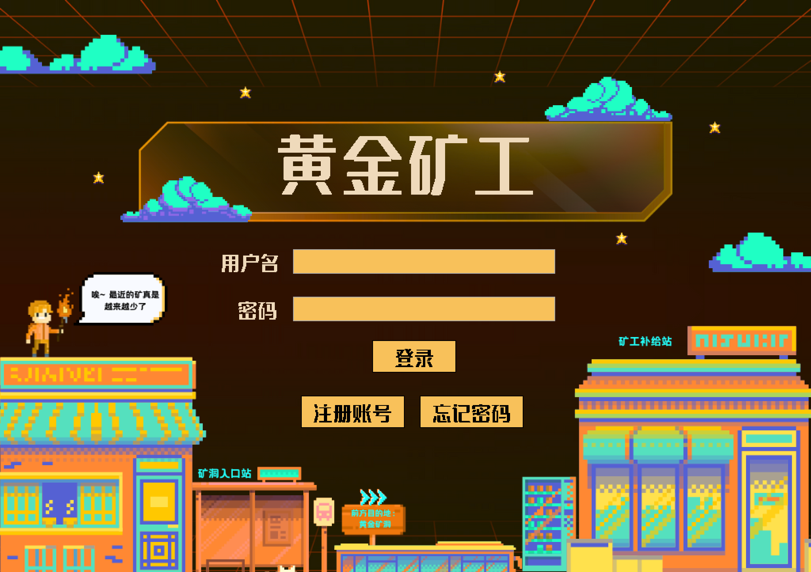
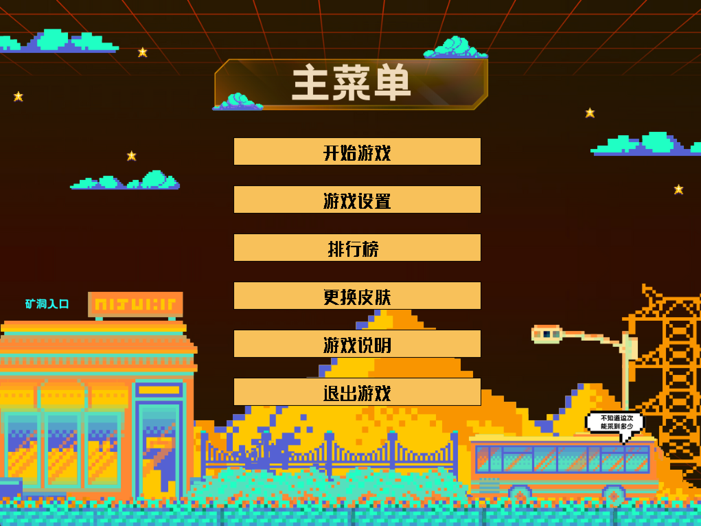
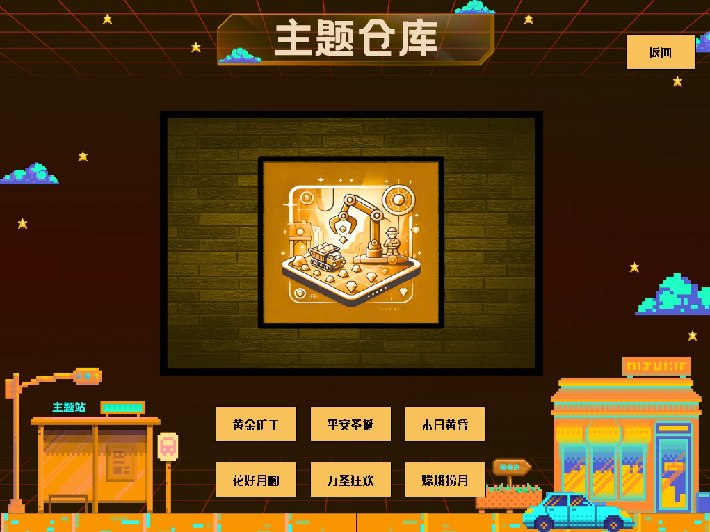
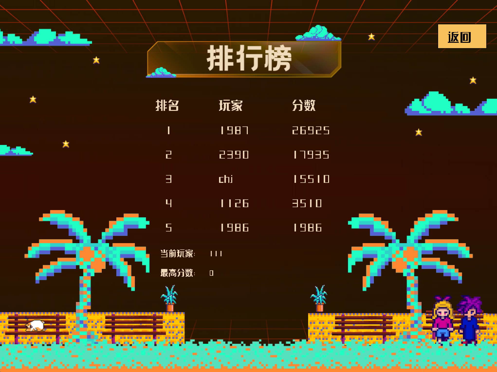
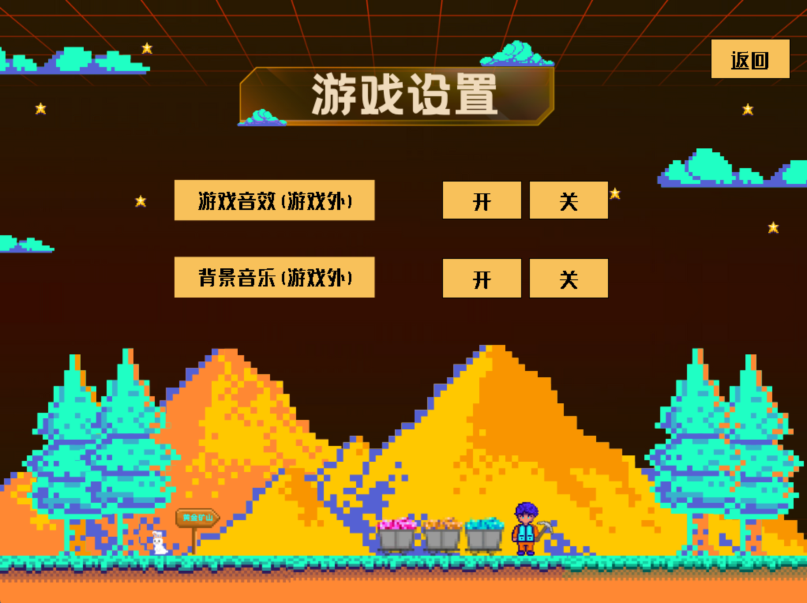
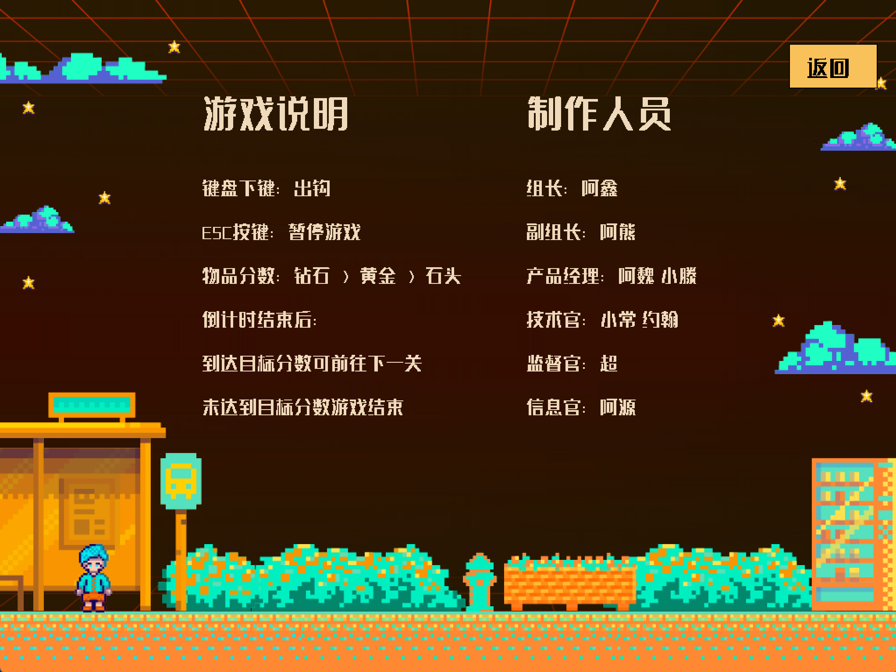

# Gold Miner

A retro-style pixel mining game developed in **C++** using the **EasyX graphics library**.  
Designed as a solo project for **portfolio showcase** and **technical interview preparation**.


## Game Preview

| Login | Main Menu | Theme Library |
|-------|-----------|---------------|
|  |  |  |

| Leaderboard | Settings | Game Instructions |
|-------------|----------|-------------------|
|  |  |  |

---

## Tech Stack

| Technology | Description |
|------------|-------------|
| `C++` | Core game logic and file I/O |
| `EasyX` | 2D graphics rendering and input handling |
| `.mp3` | Background music and sound effects |
| `Custom Assets` | Pixel-style UI and character design |


## Project Structure

```bash

├── .gitignore                   # Git ignore rules
├── LICENSE                      # License file
├── README.md                    # Project documentation
├── UpgradeLog.htm               # VS upgrade log (optional)
├── goldMiner.sln                # Visual Studio solution
├── goldMiner/                   # Main project directory
│   ├── assets/                  # Game assets (images, sounds)
│   ├── Debug/                   # Build output (ignored)
│   ├── x64/                     # Build output (ignored)
│   ├── EasyText.h               # EasyX config header
│   ├── font.ttf                 # Custom font file
│   ├── gameExplain.mp3          # Sound - instructions
│   ├── gameLogin.mp3            # Sound - login screen
│   ├── gameMenu.mp3             # Sound - main menu
│   ├── gameRank.mp3             # Sound - leaderboard
│   ├── gameSkin.mp3             # Sound - skin/theme
│   ├── main.cpp                 # Game entry point
│   ├── tools.h                  # Utility functions
│   ├── userdata.txt             # Persistent user data (scores etc.)
│   ├── 黄金矿工.vcxproj           # Visual Studio project file
│   ├── 黄金矿工.vcxproj.filters   # VS project filters
│   └── 黄金矿工.vcxproj.user      # VS user-specific config
├── preview/                     # Screenshots for README
│   ├── instruction.png
│   ├── leaderboard.png
│   ├── login.png
│   ├── menu.png
│   ├── setting.png
│   ├── success.png
│   └── theme.png
├── Setup1/                      # Installer or setup files (optional)
└── x64/                         # Build output (redundant with inner x64/)

```


## Features

- 🎮 Keyboard-controlled mining gameplay (`↓` to release hook)
- 🔐 Login & account system with local data storage
- 🎵 Background music & sound effects (toggle on/off)
- 🎨 Multiple game skins/themes
- 🏆 Local leaderboard (with persistent scores)
- 🕹️ Game timer + score target system for level progression


## How to Run

1. Open `GoldMiner.sln` in Visual Studio (Windows only)
2. Make sure **EasyX** is properly installed
3. Build and run `main.cpp`
4. Use keyboard and mouse to interact with the game


## Resume-Friendly Summary

- Built a complete 2D pixel-style mining game using C++ and EasyX from scratch.
- Implemented user authentication, multi-screen navigation, and local file storage.
- Designed modular architecture: login, menu, skin selection, scoreboard, and gameplay loop.
- Integrated sound effects and theme-based UI for immersive user experience.


## 🚧 Future Improvements
 Power-ups (e.g., bombs, speed boost)
 Level design with obstacles
 SQLite or cloud-based leaderboard
 Replace EasyX with modern frameworks (e.g., SFML, SDL)